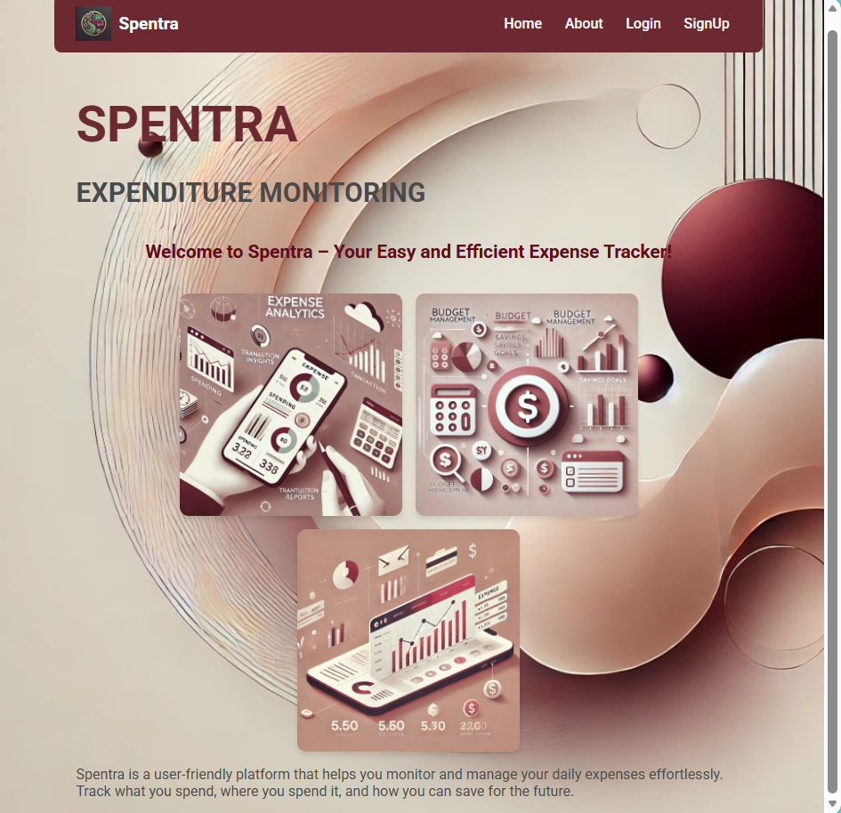
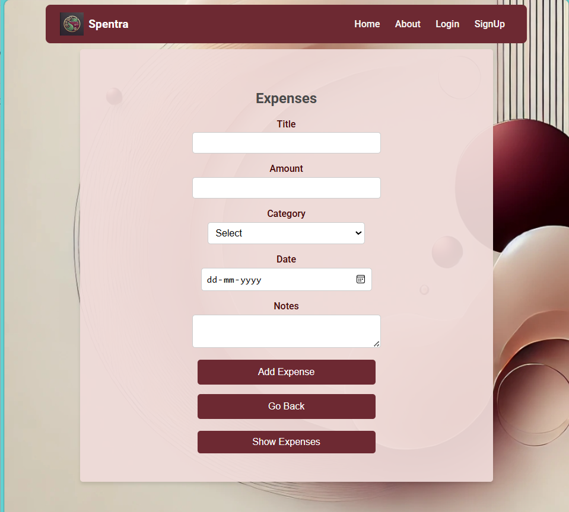
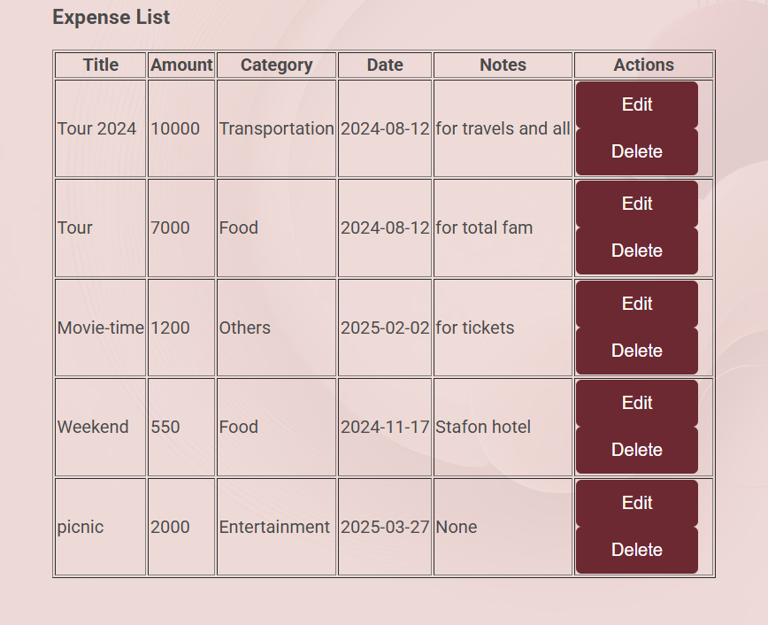

#  MERN Expense Tracker

A full-stack **Expense Tracker Web App** built using the MERN stack (MongoDB, Express, React, Node.js).

## Features

* User Signup & Login
* Add Expenses
* Edit & Delete Expenses
* View Expense List
* Separate user data 


##  Tech Stack

* Frontend: React.js
* Backend: Node.js, Express.js
* Database: MongoDB
* API: REST APIs
* Styling: CSS


##  Project Structure

backend/
src/
public/
```

## How to Run Locally

 1. Install dependencies
      npm install
 2. Run frontend
      npm start
 3. Run backend
      cd backend
      node loginproj.js

##  Test Login (Example)

Email: test@gmail.com
Password: 123456

*(You can also create your own account using signup)*


##  Screenshots






##  Live Demo

(Add after deployment)

---

## ⚠️ Note

This project uses MongoDB. For deployment, a cloud database (MongoDB Atlas) is required.


## 👩‍💻 Author

Aseera Parveen
